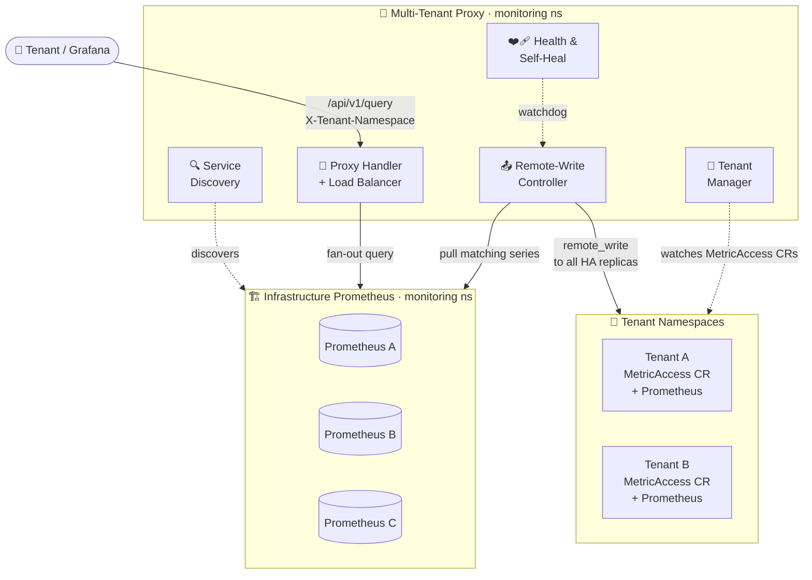
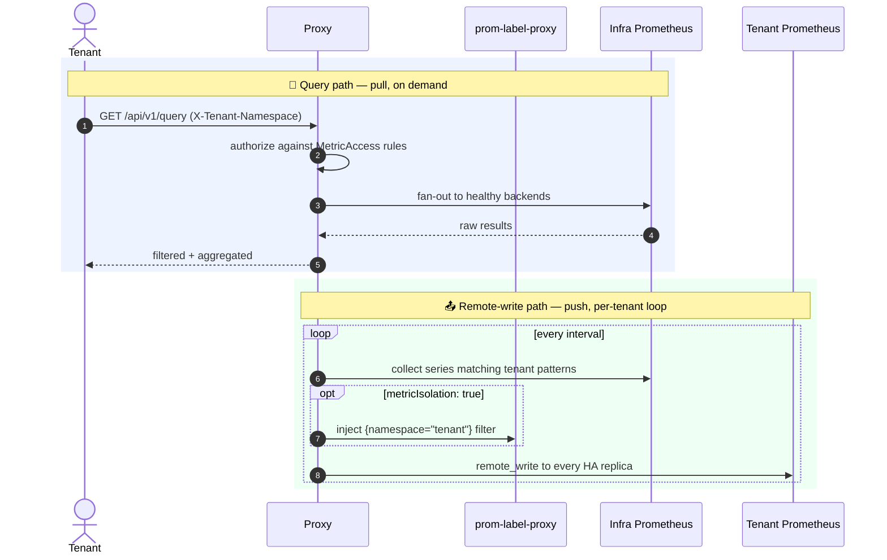
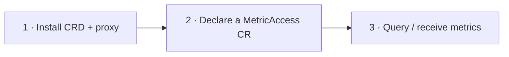
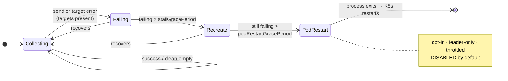
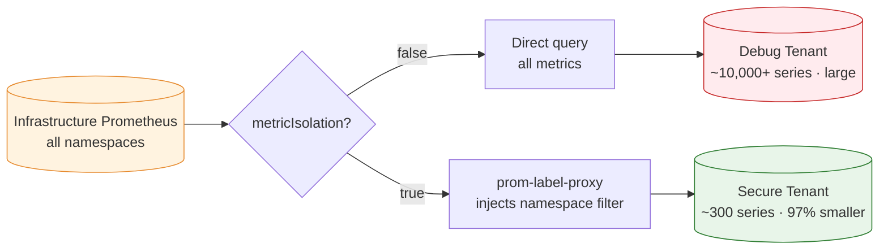

<div align="center">

# 🛰️ Prometheus Multi-Tenant Proxy

**Secure, self-healing multi-tenant access to Prometheus metrics on Kubernetes.**

Dynamic service discovery · tenant-scoped access control · intelligent query routing · automated remote-write collection — with a built-in watchdog that keeps per-tenant collection alive.

[](https://go.dev/)
[](https://kubernetes.io/)
[](https://prometheus.io/)
[](LICENSE)
[](#-contributing)

</div>

---

## ✨ Why this proxy?

Running one Prometheus per team doesn't scale, and giving every team raw access to a shared, cluster-wide Prometheus leaks data across tenants. This proxy sits in the middle: it **discovers** your infrastructure Prometheus instances, enforces **per-tenant access rules** declared as Kubernetes CRDs, and **collects + remote-writes** each tenant only the metrics they're allowed to see — optionally filtered down to their own namespace for up to **97% less storage**.

> [!TIP]
> New in this release: a **self-healing collection watchdog** that detects a wedged per-tenant collection loop and recovers it automatically — no more silent, multi-week metric gaps that only a manual pod restart could fix.

## 📖 Table of Contents

- [Architecture](#-architecture)
- [How it works](#-how-it-works)
- [Key features](#-key-features)
- [Quick start](#-quick-start)
- [Self-healing collection](#-self-healing-collection)
- [Namespace isolation](#-namespace-isolation-with-metricisolation)
- [Configuration reference](#-configuration-reference)
- [Metric pattern types](#-metric-pattern-types)
- [API endpoints](#-api-endpoints)
- [Observability](#-observability--alerting)
- [Security](#-security)
- [Development](#-development)
- [Deployment](#-deployment-options)
- [Roadmap](#-roadmap)
- [Contributing](#-contributing)

## 🏗️ Architecture



## 🔁 How it works

Two independent data paths — a **pull** path for live queries and a **push** path for background collection:



## 🚀 Key features

| Area | What you get |
| --- | --- |
| 🔍 **Service discovery** | Auto-discovers Prometheus via the Kubernetes API (Services / Pods / Endpoints), label + annotation filtering, continuous refresh with health checks |
| 🏢 **Multi-tenancy** | `MetricAccess` CRDs define access rules; multiple CRs per namespace; exact / regex / PromQL selectors; namespace isolation |
| 📤 **Remote write** | Pulls from infra Prometheus and pushes to tenants; writes to **all HA StatefulSet replicas** via pod DNS; per-metric relabeling; Prometheus / Pushgateway / external targets |
| ❤️‍🩹 **Self-healing** | Detects a stalled per-tenant collection loop and recovers it — in-process job recreate, and an **opt-in** last-resort pod restart |
| 🔀 **Smart proxying** | Round-robin load balancing, backend health checks, real-time metric filtering, multi-instance aggregation |
| 📊 **Observability** | First-class per-tenant health metrics, a shipped `PrometheusRule`, structured JSON logs, rich debug endpoints |

## 🚀 Quick start

> **Prerequisites:** a Kubernetes cluster (1.19+), `kubectl`, and Go 1.21+ if building from source.



### 1 · Install the CRD and proxy

```bash
kubectl apply -f deploy/kubernetes/crd.yaml
kubectl apply -f deploy/kubernetes/configmap.yaml
kubectl apply -f deploy/kubernetes/enhanced-deployment-ready.yaml
```

### 2 · Declare a tenant with a `MetricAccess` CR

```yaml
apiVersion: observability.ethos.io/v1alpha1
kind: MetricAccess
metadata:
  name: my-app-metrics
  namespace: my-app-namespace
spec:
  source: my-app-namespace
  metricIsolation: true          # only collect this namespace's metrics
  metrics:
    - "http_requests_total"
    - "http_request_duration_seconds"
    - '{job="my-app"}'
  remoteWrite:
    enabled: true
    interval: "30s"
    target:
      type: "prometheus"
    prometheus:
      serviceName: "prometheus-operated"
      servicePort: 9090
      replicas: 2                 # write to all HA replicas via pod DNS
      statefulSetName: "prometheus-my-app"
    extraLabels:
      tenant: "my-app-namespace"
      managed_by: "multi-tenant-proxy"
    honorLabels: true
```

```bash
kubectl apply -f my-app-metrics.yaml
```

### 3 · Query through the proxy

```bash
kubectl port-forward svc/prometheus-multi-tenant-proxy 8080:8080 -n monitoring

curl -H "X-Tenant-Namespace: my-app-namespace" \
  "http://localhost:8080/api/v1/query?query=up"
```

## ❤️‍🩹 Self-healing collection

A per-tenant collection loop can silently wedge — collecting **zero series while the data is right there at the source** — and stay broken until someone notices and restarts the pod. This proxy detects and recovers from that automatically.



**Design guardrails** (so it heals real faults without causing harm):

- **Acts only on genuine collection *failures*** (send / target errors), never on a tenant that legitimately has no matching series or on a source outage — so it won't restart-loop on idle tenants.
- **In-process recreate first**, rate-limited by `recreate_backoff`; the **pod restart is a last resort**, is **opt-in (off by default)**, leader-only, and throttled by `pod_restart_cooldown`.
- Every state is observable via the [health metrics](#-observability--alerting) and the shipped alert.

Enable the last-resort restart explicitly:

```bash
--self-heal-pod-restart=true        # or set remote_write.self_heal_pod_restart: true
```

## 🔒 Namespace isolation with `metricIsolation`

When `metricIsolation: true`, collection is routed through [`prom-label-proxy`](https://github.com/prometheus-community/prom-label-proxy), which injects `{namespace="<tenant>"}` into every query — so a tenant's Prometheus only ever stores its own namespace's data.



| Configuration | Series collected | Storage | Query speed | Isolation |
| --- | --- | --- | --- | --- |
| `metricIsolation: false` | ~10,000+ (all namespaces) | High | Slower | Query-time only |
| `metricIsolation: true` | ~300 (tenant only) | **~97% less** | **Faster** | **Collection + query** |

## ⚙️ Configuration reference

<details>
<summary><b>Proxy configuration (ConfigMap YAML)</b></summary>

```yaml
discovery:
  kubernetes:
    namespaces: [monitoring]
    label_selectors:
      app.kubernetes.io/name: prometheus
    port: "9090"
    resource_types: [Pod]
  refresh_interval: 30s

tenants:
  watch_all_namespaces: true

proxy:
  enable_caching: true
  cache_ttl: 5m
  enable_metrics: true            # serves /metrics (health metrics live here)
  enable_request_logging: true
  max_concurrent_requests: 100
  backend_timeout: 30s

remote_write:
  enabled: true
  collection_interval: 30s
  batch_size: 5000

  # Self-healing collection watchdog
  stall_grace_period: 15m         # no clean collection this long ⇒ stalled
  recreate_backoff: 5m            # min interval between in-process recreates
  pod_restart_grace_period: 45m   # still failing after recreate ⇒ eligible for restart
  pod_restart_cooldown: 30m       # min interval between self-restarts
  self_heal_pod_restart: false    # last-resort pod restart — OPT-IN (default off)
```

</details>

<details>
<summary><b>MetricAccess CRD (full spec)</b></summary>

```yaml
apiVersion: observability.ethos.io/v1alpha1
kind: MetricAccess
metadata:
  name: tenant-metrics-access
  namespace: tenant-namespace
spec:
  source: tenant-namespace
  metricIsolation: true
  metrics:
    - "http_requests_total"                            # exact
    - "http_.*"                                        # regex
    - '{job="my-app"}'                                 # PromQL selector
    - "node_cpu_seconds_total{job=\"node-exporter\"}"  # with labels
  labelSelectors:
    environment: "production"
  remoteWrite:
    enabled: true
    interval: "30s"
    target:
      type: "prometheus"          # prometheus | pushgateway | remote_write
    prometheus:
      serviceName: "prometheus-operated"
      servicePort: 9090
      replicas: 2
      statefulSetName: "prometheus-tenant-prometheus"
    extraLabels:
      tenant: "tenant-namespace"
      managed_by: "multi-tenant-proxy"
    honorLabels: true
    metricRelabelings:            # mirrors Prometheus metricRelabelings
      - sourceLabels: [__name__]
        regex: "container_(.*)"
        targetLabel: metrics_path
        replacement: "/metrics/cadvisor"
```

</details>

<details>
<summary><b>Remote-write target types (single / HA / pushgateway / external)</b></summary>

```yaml
# HA Prometheus — writes to every replica via pod DNS
remoteWrite:
  enabled: true
  interval: "30s"
  target: { type: "prometheus" }
  prometheus:
    serviceName: "prometheus-operated"
    servicePort: 9090
    replicas: 2
    statefulSetName: "prometheus-my-prom"
---
# Pushgateway
remoteWrite:
  enabled: true
  interval: "60s"
  target: { type: "pushgateway" }
  pushgateway: { serviceName: "pushgateway", servicePort: 9091, jobName: "remote-write-metrics" }
---
# External remote-write endpoint
remoteWrite:
  enabled: true
  interval: "15s"
  target: { type: "remote_write" }
  remoteWrite:
    url: "https://external-prometheus.example.com/api/v1/write"
    basicAuth:
      username: "monitoring-user"
      passwordSecret: { name: "prometheus-auth", key: "password" }
    headers: { X-Tenant: "my-team" }
```

When `replicas` + `statefulSetName` are set, the proxy resolves each pod's DNS (e.g. `prometheus-my-prom-0.prometheus-operated.ns.svc:9090`) and writes to all replicas concurrently, so every HA instance receives identical data.

</details>

> [!IMPORTANT]
> The tenant Prometheus must accept remote write — start it with `--web.enable-remote-write-receiver`.

## 🔧 Metric pattern types

```yaml
metrics:
  - "http_requests_total"                                   # 1 · exact match
  - "http_.*"                                               # 2 · regex
  - '{job="my-app"}'                                        # 3 · PromQL selector
  - '{__name__=~"node_.*",job="node-exporter",namespace="monitoring"}'  # 4 · complex
```

## 📡 API endpoints

| Endpoint | Purpose |
| --- | --- |
| `GET /api/v1/query`, `/query_range`, `/series`, `/labels` | Prometheus API, proxied + tenant-filtered |
| `GET /health` | Health check with tenant & target stats |
| `GET /metrics` | Prometheus metrics (when `enable_metrics: true`) |
| `GET /debug/targets` | Discovered Prometheus targets + health |
| `GET /debug/tenants` | Active tenants & access rules |
| `GET /collected-metrics` | Series collected by the remote-write controller |

**Authentication:** identify the tenant via the `X-Tenant-Namespace` header (primary) or `namespace` query parameter (fallback).

## 📊 Observability & alerting

Per-tenant collection-health metrics (on `/metrics`) let you alert on silent stalls without guessing from raw `up`:

| Metric | Meaning |
| --- | --- |
| `proxy_tenant_collection_up{namespace,name}` | `1` if the last cycle stored ≥1 series and the write succeeded, else `0` |
| `proxy_tenant_last_successful_collection_timestamp_seconds` | Unix time of last successful collection |
| `proxy_tenant_collected_series` | Series stored in the last cycle |
| `proxy_tenant_stall_recreations_total` | In-process self-heal recreations |
| `proxy_self_restart_total` | Last-resort self-heal pod restarts (best-effort) |

A ready-to-ship **`PrometheusRule`** lives in [`deploy/alerts/`](deploy/alerts/) — the primary alert fires on `proxy_tenant_collection_up == 0` sustained for 15m, and it ships with a promtool test suite.

<details>
<summary><b>Structured logs</b></summary>

```json
{ "level": "info", "time": "2024-01-15T10:30:00Z",
  "msg": "Aggregated and filtered results from all targets",
  "tenant_id": "my-app-namespace/my-app-metrics",
  "total_metrics": 1363, "successful_targets": 3 }
```

</details>

## 🔒 Security

- **Tenant identity** via `X-Tenant-Namespace`; each tenant only reaches its own namespace configuration.
- **Metric-level access control** — fine-grained allowlists per tenant, plus label-based filtering.
- **Hardened runtime** — minimal RBAC service account, non-root user (`65534`), read-only root filesystem, all capabilities dropped, no privilege escalation.
- **Namespace boundaries** enforced at collection and query time; combine with Kubernetes NetworkPolicies and ResourceQuotas.

## 🛠️ Development

```bash
git clone https://github.com/adobe/prometheus-multi-tenant-proxy
cd prometheus-multi-tenant-proxy

go build -o prometheus-multi-tenant-proxy ./cmd/proxy   # build
go test -race ./...                                     # test (race detector)
docker build -t prometheus-multi-tenant-proxy:latest .  # image
```

<details>
<summary><b>Project structure</b></summary>

```
├── api/v1alpha1/          # MetricAccess CRD types
├── cmd/proxy/             # main entry point
├── internal/
│   ├── config/            # configuration
│   ├── discovery/         # Kubernetes service discovery
│   ├── proxy/             # HTTP proxy + load balancing
│   ├── tenant/            # tenant management / access control
│   └── remote_write/      # collection, remote write, self-heal, metrics
├── deploy/
│   ├── kubernetes/        # CRD, ConfigMap, Deployment
│   └── alerts/            # PrometheusRule + promtool tests
├── docs/                  # deep-dive docs
└── Dockerfile
```

</details>

## 🚀 Deployment options

```bash
# Kubernetes (recommended)
kubectl apply -f deploy/kubernetes/

# Docker
docker run -p 8080:8080 \
  -v /path/to/config.yaml:/etc/prometheus-proxy/config.yaml \
  bnkarthik6/prometheus-multi-tenant-proxy:latest \
  --config=/etc/prometheus-proxy/config.yaml

# Binary
./prometheus-multi-tenant-proxy --config=config.yaml --port=8080 --log-level=info
```

## 🗺️ Roadmap

- [x] Multi-tenant metric filtering
- [x] Remote write (single, HA multi-replica, pushgateway, external)
- [x] Dynamic service discovery
- [x] Multiple `MetricAccess` CRs per namespace
- [x] Per-metric relabeling (`metricRelabelings`)
- [x] **Self-healing collection + per-tenant health metrics & alerts**
- [ ] Multi-cluster support
- [ ] Grafana integration
- [ ] Advanced auth providers (OIDC, LDAP)
- [ ] Horizontal pod autoscaling

## 🤝 Contributing

Contributions welcome! Fork → feature branch → add tests → `go test -race ./...` → open a PR.
See [CONTRIBUTING.md](CONTRIBUTING.md) if present, and browse deep-dive docs under [`docs/`](docs/).

## 📄 License

Licensed under the [Apache License 2.0](LICENSE).
